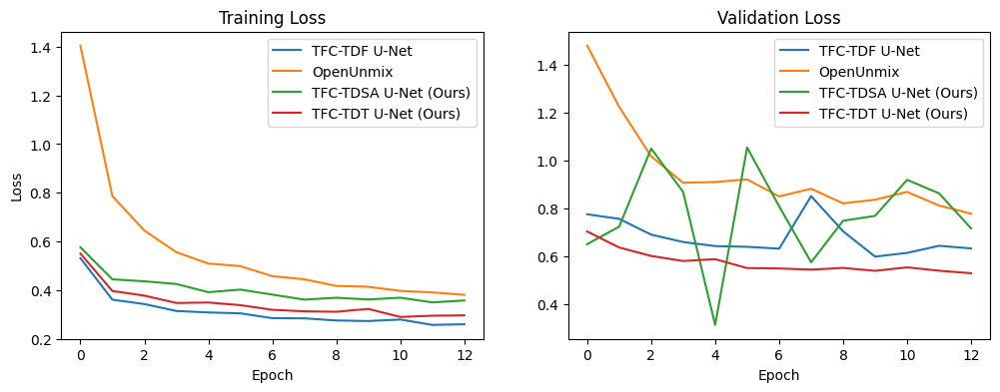

# Lead and Accompaniment Separation
## Description 
In this project, we present two novel attention-based variants of the TFC-TDF-UNet architecture, namely TFC-TDSA-UNet and TFC-TDT-UNet, aiming to further improve the performance of lead and accompaniment separation. The models adopt the Complex as Channel (CaC) framework to estimate a vocal isolated spectrogram. Experiments on MUSDB18-HQ benchmark show the superior training speed of the UNet architecture, and demonstrate the potential improvement of attention mechanism on music separation tasks. [Access report](./assets/report.pdf)

## Usage
1. Run the following commands to install dependencies
```
pip install einops torch==2.1.1 torchaudio==2.1.1
pip install -e git+https://github.com/shi0rik0/open-unmix-pytorch.git#egg=openunmix
python scripts/download_musdb_hq.py
```
2. Run the script to separate lead vocal from a music mixture
```
python scripts/evaluate.py --mixture_path /path/to/music/mixture.wav --segment_size 10.0
```

## Training
We implement OpenUnmix, TFC-TDF-UNet, TFC-TDSA-UNet and TFC-TDT-UNet for comparison. The models are optimised on the mean squared error between the target spectrogram and the expected spectrogram using the Adam optimiser with a weight decay of 0.000001. The learning rate is scheduled using the ReduceLROnPlateau scheduler in Pytorch with a factor of 0.3 and an initial rate of 0.001. All models are trained on RTX3090 with a batch size of 8 for 13 epochs. The figure below illustrates the training and validation losses over the epochs.  




## Evaluation
The average validation loss values across the 13 epochs are reported in the table below for evaluation.

| Model        | Number of parameters    | MSE Loss|
|--------------|-----------|------------|
| OpenUnmix | 9.46M | 0.946    |
| TFC-TDF-UNet | 1.80M | 0.680 |
| TFC-TDSA-UNet (Ours) | 5.29M | 0.773 |
| TFC-TDT-UNet (Ours) | 0.08M | **0.574** |


## Directory structure
```
.
├── assets
├── datasets
│   └── musdb18hq
│       ├── test
│       └── train
├── scripts
│   ├── download_musdb_hq.py
│   ├── evaluate.py
│   ├── train.py
│   ├── train_accelerate.py
│   └── train_openunmix.py
├── source
│   ├── __pycache__
│   ├── model
│   │   ├── TFC_TDF_UNet
│   │   │   ├── __init__.py
│   │   │   ├── building_blocks.py
│   │   │   └── unet.py
│   │   ├── TFC_TDSA_UNet
│   │   │   ├── __init__.py
│   │   │   ├── building_blocks.py
│   │   │   └── unet.py
│   │   ├── TFC_TDT_UNet
│   │   │   ├── __init__.py
│   │   │   ├── building_blocks.py
│   │   │   ├── unet.py
│   │   │   └── weights
│   │   │       └── vocals_transformer_0511.pth
│   │   ├── __init__.py
│   │   ├── attention.py
│   │   ├── basic_blocks.py
│   │   ├── processing.py
│   │   └── unet_blocks.py
│   └── utils
│       ├── __init__.py
│       ├── audio_utils.py
│       ├── log_utils.py
│       └── path_utils.py
├── src
│   └── openunmix
└── test
    ├── model
    │   ├── TFC_TDF_UNet
    │   │   ├── __init__.py
    │   │   ├── processing_example.py
    │   │   ├── test_building_blocks.py
    │   │   └── test_unet.py
    │   ├── TFC_TDSA_UNet
    │   │   ├── __init__.py
    │   │   ├── test_building_blocks.py
    │   │   └── test_unet.py
    │   ├── TFC_TDT_UNet
    │   │   ├── __init__.py
    │   │   ├── test_building_blocks.py
    │   │   └── test_unet.py
    │   ├── __init__.py
    │   ├── test_attention.py
    │   ├── test_basicBlocks.py
    │   └── test_processing.py
    └── run_test.py


```
